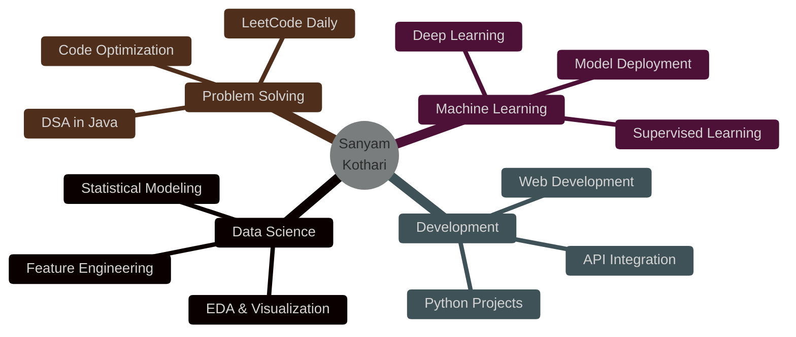

<div align="center">

<!-- Animated Header -->


<!-- Typing Animation with Multiple Lines -->
<a href="https://git.io/typing-svg"></a>

<!-- Profile Badges -->
<p>
  
  
  
</p>

<!-- Social Links with Hover Effects -->
<p>
  <a href="https://www.linkedin.com/in/sanyam-kothari-7207b8341/">
    
  </a>
  <a href="mailto:samwork182004@gmail.com">
    
  </a>
  <a href="https://github.com/Sanyam9804">
    
  </a>
  <a href="https://leetcode.com/sanyam_kothari19">
    
  </a>
</p>

<!-- Profile View Counter -->


</div>

<br/>

<!-- About Me Section with Gradient -->


##  About Me

```python
class DataScientist:
    def __init__(self):
        self.name = "Sanyam Kothari"
        self.role = "Data Scientist & ML Engineer"
        self.location = "Ajmer, Rajasthan 🇮🇳"
        self.education = "B.Tech CSE Student"
        self.passion = "Transforming Data into Actionable Insights"
        
    def get_skills(self):
        return {
            "languages": ["Python", "Java", "SQL", "JavaScript"],
            "data_science": ["Pandas", "NumPy", "Scikit-Learn", "TensorFlow"],
            "visualization": ["Matplotlib", "Seaborn", "Power BI", "Plotly"],
            "databases": ["MySQL", "PostgreSQL", "MongoDB"],
            "tools": ["Jupyter", "Git", "VS Code", "Google Colab"],
            "specialties": ["Machine Learning", "Deep Learning", "EDA", "Statistical Analysis"]
        }
    
    def current_mission(self):
        return [
            "🔬 Building end-to-end ML pipelines",
            "📊 Analyzing complex datasets for insights",
            "🧠 Mastering Deep Learning & Neural Networks",
            "💻 Solving 500+ DSA problems",
            "🚀 Contributing to Open Source"
        ]
    
    def seeking(self):
        return "Data Science | ML Engineer | Research Internships 🎯"

# Initialize
me = DataScientist()
print(me.seeking())
```

<br/>

<!-- Tech Stack Section -->


##  Tech Arsenal

<div align="center">

### 🐍 Languages & Frameworks
<p>
  
  
  
  
  
</p>

### 🤖 Data Science & ML
<p>
  
  
  
  
  
  
</p>

### 📊 Data Visualization & BI
<p>
  
  
  
  
  
</p>

### 🗄️ Databases & Tools
<p>
  
  
  
  
  
  
</p>

</div>

<br/>

<!-- Skills Section with Icons -->


## 🎯 Core Competencies

<div align="center">
<table>
<tr>
<td align="center" width="33%">

<br><b>Data Science</b>
<br><br>
• Data Wrangling<br>
• Statistical Analysis<br>
• EDA & Feature Engineering<br>
• A/B Testing<br>
• Predictive Modeling
</td>
<td align="center" width="33%">

<br><b>Machine Learning</b>
<br><br>
• Supervised Learning<br>
• Deep Learning<br>
• Model Optimization<br>
• Cross-Validation<br>
• Ensemble Methods
</td>
<td align="center" width="33%">

<br><b>Data Engineering</b>
<br><br>
• SQL Optimization<br>
• ETL Pipelines<br>
• Database Design<br>
• Data Warehousing<br>
• Big Data Processing
</td>
</tr>
</table>
</div>

<br/>

<!-- GitHub Stats Section -->


## 📊 GitHub Analytics

<div align="center">
  
<!-- Streak Stats with New Theme -->


<!-- GitHub Stats Card -->


<!-- Top Languages -->


<!-- Trophy -->


<!-- Activity Graph -->


</div>

<br/>

<!-- Competitive Programming Section -->


## 🏆 Competitive Programming

<div align="center">

<table>
<tr>
<td align="center" width="33%">
<a href="https://codeforces.com/profile/sanyam1918">

<br><b>Codeforces</b>
<br><br>

</a>
</td>
<td align="center" width="33%">
<a href="https://leetcode.com/sanyam_kothari19">

<br><b>LeetCode</b>
<br><br>

</a>
</td>
<td align="center" width="33%">
<a href="https://auth.geeksforgeeks.org/user/samworklyco">

<br><b>GeeksforGeeks</b>
<br><br>

</a>
</td>
</tr>
</table>

</div>

<br/>

<!-- Current Focus Section -->


## 🌟 Current Focus

<div align="center">



</div>

<table align="center">
<tr>
<td width="50%" valign="top">

### 🔭 Working On
- 🚀 End-to-end ML Projects
- 📊 Real-world Data Analysis
- 🧠 Deep Learning Models
- 💼 Building Portfolio Projects

</td>
<td width="50%" valign="top">

### 🌱 Learning
- 🤖 Advanced ML Algorithms
- 📈 Time Series Analysis
- 🧪 MLOps & Deployment
- ☁️ Cloud Computing (AWS)

</td>
</tr>
</table>

<br/>

<!-- Quote Section -->


## 💭 Random Dev Quote

<div align="center">


</div>

<br/>

<!-- Footer -->


<div align="center">

### 🤝 Open for Collaborations & Opportunities

<p>
<b>💼 Looking for:</b> Data Science Internships | ML Engineer Roles | Research Opportunities
</p>

<p>
<b>🎯 Interests:</b> Machine Learning • Deep Learning • Data Analytics • Computer Vision • NLP
</p>

<br/>

### 📫 Let's Connect and Build Something Amazing!

<a href="https://www.linkedin.com/in/sanyam-kothari-7207b8341/">
  
</a>
<a href="mailto:samwork182004@gmail.com">
  
</a>
<a href="https://github.com/Sanyam9804">
  
</a>

<br/><br/>


**⭐️ From [Sanyam9804](https://github.com/Sanyam9804) | Made with 💙 and ☕**

</div>
